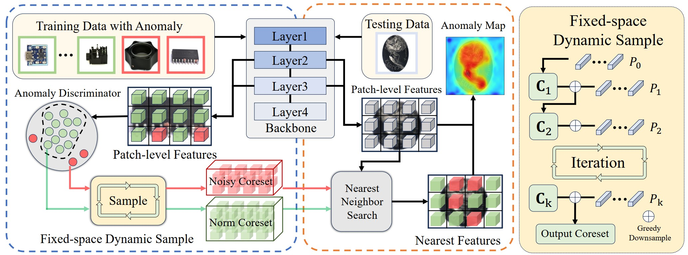

# DynamicPatch



### Requirement
Our results were computed using Python 3.8 with packages and respective version noted in requirements.txt. 

### Real-IAD

To train SoftPatch on Real-IAD with 0.4 anomaly samples, run

```
datapath=/path_to_real_iad/real_iad
datasets=("audiojack" "bottle_cap" "button_battery" "end_cap" "eraser" "fire_hood" "mint" "mounts" "pcb" "phone_battery" "plastic_nut" "plastic_plug" "porcelain_doll" "regulator" "rolled_strip_base" "sim_card_set" "switch" "tape" "terminalblock" "toothbrush" "toy" "toy_brick" "transistor1" "u_block" "usb" "usb_adaptor" "vcpill" "wooden_beads" "woodstick" "zipper")
dataset_flags=($(for dataset in "${datasets[@]}"; do echo '-d '$dataset; done))

python main.py --dataset real_iad --gpu 0 --data_path ./datasets/Real-IAD/realiad_256 --bank_size 0.02 --threshold 0.3 --exp_json_path ./datasets/Real-IAD/realiad_jsons_fuiad_0.4 --noise 0  "${dataset_flags[@]}"  --faiss_on_gpu
```

The default setting in ```run_real_iad_0.4.sh``` runs with 224x224 image size using a WideResNet50-backbone pretrained on ImageNet. 

# Comments
- Our codebase for the coreset construction builds heavily on [SoftPatch](https://github.com/TencentYoutuResearch/AnomalyDetection-SoftPatch) codebase. Thanks for open-sourcing!
